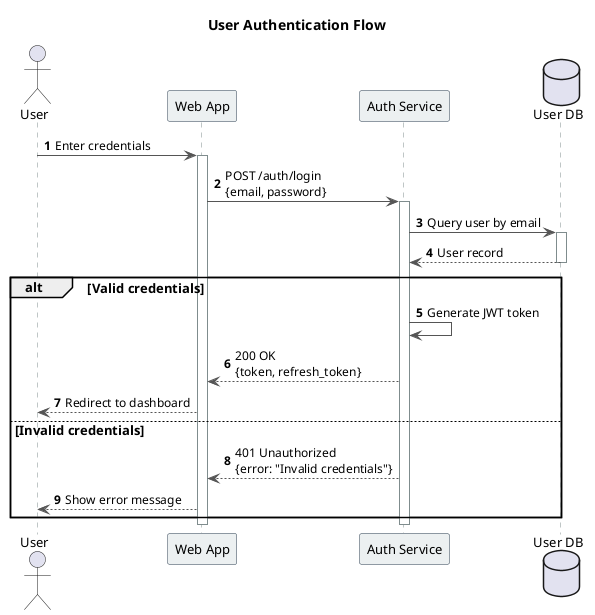
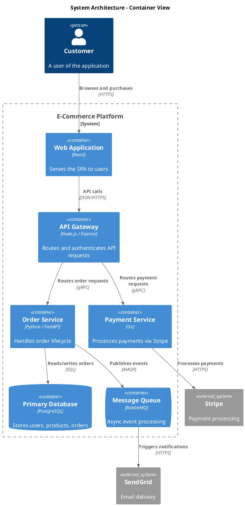
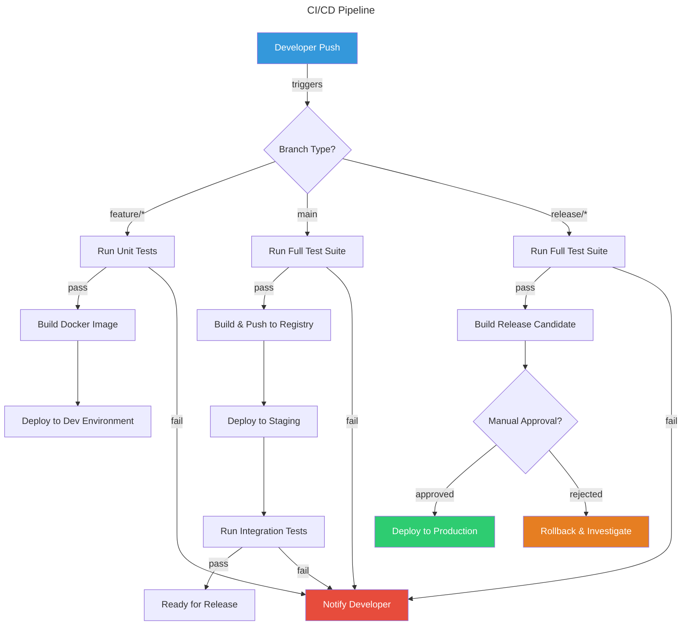
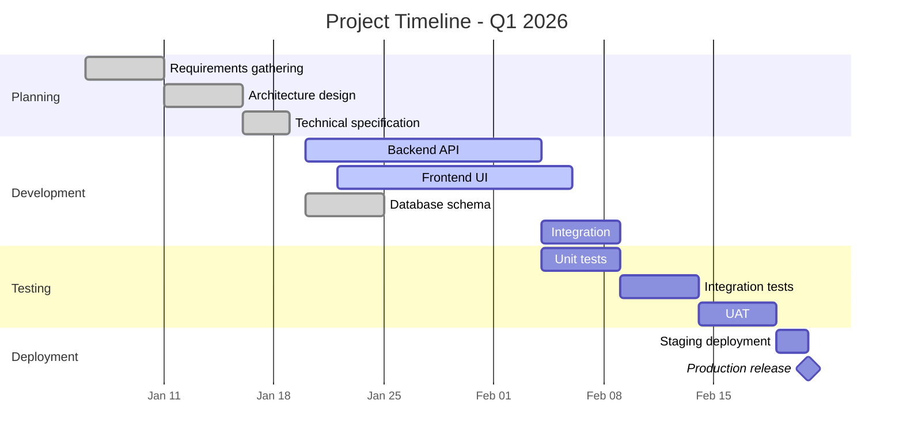
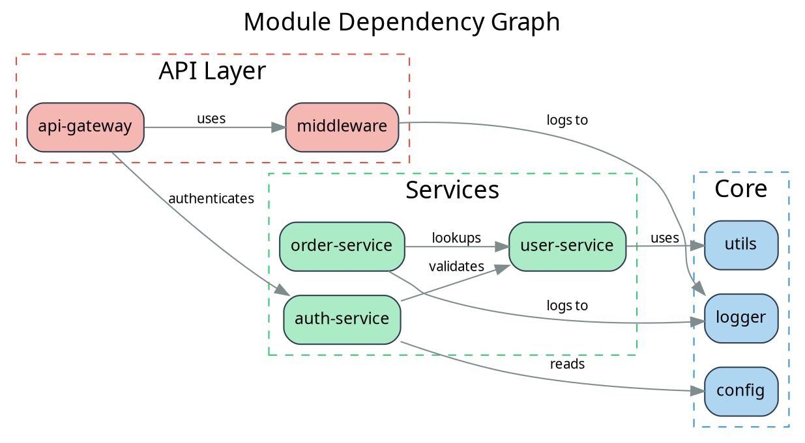

# Diagram Script Examples

Reference examples for the most commonly used diagram types. Use these as starting templates and adapt to the specific use case.

## PlantUML — Sequence Diagram



## PlantUML — Activity / Workflow Diagram

```plantuml
@startuml
skinparam backgroundColor white
skinparam shadowing false
skinparam defaultFontName "Segoe UI"
skinparam ActivityBorderColor #2C3E50
skinparam ActivityBackgroundColor #ECF0F1
skinparam ActivityDiamondBorderColor #E74C3C

title Order Processing Workflow

start

:Customer places order;

|#LightBlue|Payment Service|
:Validate payment details;

if (Payment valid?) then (yes)
    :Charge payment method;
    if (Payment successful?) then (yes)
        :Generate confirmation number;
    else (no)
        :Log payment failure;
        :Notify customer of failure;
        stop
    endif
else (no)
    :Return validation errors;
    stop
endif

|#LightGreen|Fulfillment Service|
:Reserve inventory;
:Create shipping label;
:Queue for dispatch;

|#LightYellow|Notification Service|
:Send confirmation email;
:Send SMS notification;

stop

@enduml
```

## PlantUML — C4 Container Diagram



## Mermaid — Flowchart



## Mermaid — Gantt Chart



## GraphViz (DOT) — Dependency Graph



## D2 — Architecture Diagram

```d2
title: |md
  # Microservices Architecture
| {near: top-center}

direction: right

clients: {
  label: "Client Layer"
  style.fill: "#E8F4FD"

  web: Web Browser {shape: rectangle}
  mobile: Mobile App {shape: rectangle}
}

gateway: API Gateway {
  shape: hexagon
  style.fill: "#FFF3CD"
}

services: {
  label: "Service Layer"
  style.fill: "#D4EDDA"

  auth: Auth Service {shape: rectangle}
  users: User Service {shape: rectangle}
  orders: Order Service {shape: rectangle}
  notifications: Notification Service {shape: rectangle}
}

data: {
  label: "Data Layer"
  style.fill: "#F8D7DA"

  postgres: PostgreSQL {shape: cylinder}
  redis: Redis Cache {shape: cylinder}
  queue: Message Queue {shape: queue}
}

external: {
  label: "External"
  style.fill: "#E2E3E5"

  stripe: Stripe {shape: cloud}
  sendgrid: SendGrid {shape: cloud}
}

clients.web -> gateway: HTTPS
clients.mobile -> gateway: HTTPS

gateway -> services.auth: Authenticate
gateway -> services.users: User CRUD
gateway -> services.orders: Order CRUD

services.auth -> data.redis: Session cache
services.users -> data.postgres: Read/Write
services.orders -> data.postgres: Read/Write
services.orders -> data.queue: Publish events
data.queue -> services.notifications: Consume events

services.orders -> external.stripe: Process payment
services.notifications -> external.sendgrid: Send email
```

## ERD — Entity Relationship Diagram

```erd
title {label: "E-Commerce Database Schema"}

[Customer] {bgcolor: "#ECF0F1"}
  *id {label: "int, PK"}
  email {label: "varchar(255), unique"}
  name {label: "varchar(100)"}
  created_at {label: "timestamp"}

[Product] {bgcolor: "#ECF0F1"}
  *id {label: "int, PK"}
  name {label: "varchar(200)"}
  price {label: "decimal(10,2)"}
  category_id {label: "int, FK"}

[Order] {bgcolor: "#D5F5E3"}
  *id {label: "int, PK"}
  customer_id {label: "int, FK"}
  status {label: "enum"}
  total {label: "decimal(10,2)"}
  created_at {label: "timestamp"}

[OrderItem] {bgcolor: "#D5F5E3"}
  *id {label: "int, PK"}
  order_id {label: "int, FK"}
  product_id {label: "int, FK"}
  quantity {label: "int"}
  unit_price {label: "decimal(10,2)"}

[Category] {bgcolor: "#FADBD8"}
  *id {label: "int, PK"}
  name {label: "varchar(100)"}

Customer 1--* Order {label: "places"}
Order 1--* OrderItem {label: "contains"}
Product 1--* OrderItem {label: "included in"}
Category 1--* Product {label: "categorizes"}
```

## NwDiag — Network Diagram

```nwdiag
nwdiag {
    internet [shape = cloud];
    internet -- router;

    network dmz {
        address = "210.x.x.x/24"
        color = "#FADBD8"

        router [address = "210.x.x.1"];
        firewall [address = "210.x.x.2"];
        web01 [address = "210.x.x.10", description = "NGINX\nLoad Balancer"];
    }

    network internal {
        address = "172.x.x.x/24"
        color = "#D5F5E3"

        firewall [address = "172.x.x.1"];
        app01 [address = "172.x.x.10", description = "App Server 1\nNode.js"];
        app02 [address = "172.x.x.11", description = "App Server 2\nNode.js"];
    }

    network data {
        address = "192.168.x.x/24"
        color = "#AED6F1"

        app01 [address = "192.168.x.10"];
        app02 [address = "192.168.x.11"];
        db01 [address = "192.168.x.20", description = "Primary DB\nPostgreSQL"];
        db02 [address = "192.168.x.21", description = "Replica DB\nPostgreSQL"];
        cache [address = "192.168.x.30", description = "Redis\nCache"];
    }
}
```
